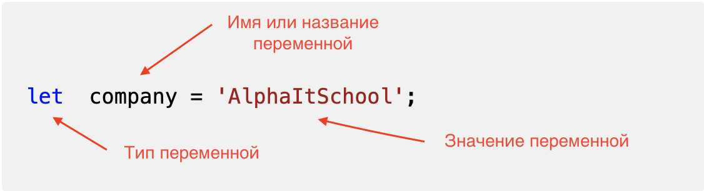

# JavaScript Basics

## Занятие 1 - Переменные и типы данных

`Переменная (variable)` - область памяти, в которой мы храним данные.



`Типы` переменных

```js
let // Может менять значение
const // Не может менять значение, константа, всегда должна быть инициализирована
var // Старый стандарт ES5, может менять значение, не рекомендуется к использованию
```

Для названия переменных используем `camelCase`

```js
let myAwesomeVariable; //первое слово с маленькой буквы, остальные с большой
```

Вывод данных в командную строку

```js
console.log('Some text'); // 'Some text' отобразился в консоли

let name = 'Stas';
console.log(name); // 'Stas' (значение переменной name) отобразилось в консоли 
```

## Для имен переменных должны выполняться следующие правила:

 - Имя каждой переменной должно быть уникальным; дубликаты имен не допускаются.
 - Имена переменных не могут содержать пробелов.
 - Нельзя начинать имя переменной с служебных или системных символов- таких как # $ 
 - Имена переменных не должны начинаться или заканчиваться точкой.
 - Следует избегать имен переменных, заканчивающихся символом подчеркивания, поскольку возможен конфликт с именами, созданными автоматически командами и процедурами.
 - В именах переменных не могут использоваться зарезервированные ключевые слова. Зарезервированными словами являются ALL, AND, BY, EQ, GE, GT, LE, LT, NE, NOT, OR, TO и WITH.
 - Имена переменных могут состоять из любого сочетания символов в верхнем и в нижнем регистрах. Регистр сохраняется при выводе на экран имен переменных.
 - В именах нельзя использовать точку - так как может быть воспринято системой как вызов функции.


## Типы данных

```js
string - тип string - строка (слово, фраза, предложение, абзац, любой текст)
let cat = 'Iko'; //строка всегда берется в кавычки 
```

```js
number  - тип number число (если нет кавычек)
let age = 5; //число без кавычек
age = '5'; // cтрока c числом внутри
```

```js
boolean - Булевые значения (логические: true/false)
let isCold = true;// True  - истина
isCold = false;// False - Ложь
```

### Значение `null`
```js
let forest = null;// "Ничего", "Пусто" или "Значение не известно"
```

### Значение `undefined`
```js
let column; // undefined  -  oзначает что "значение не было присвоено" или если переменная была объявлена, но ей не было присвоено никакого 
значения, функция ничего не вернула
```

## Определение типа переменных с помощью оператора `typeof`
```js
let language = 'Italian';
console.log(typeof language); // string
```


