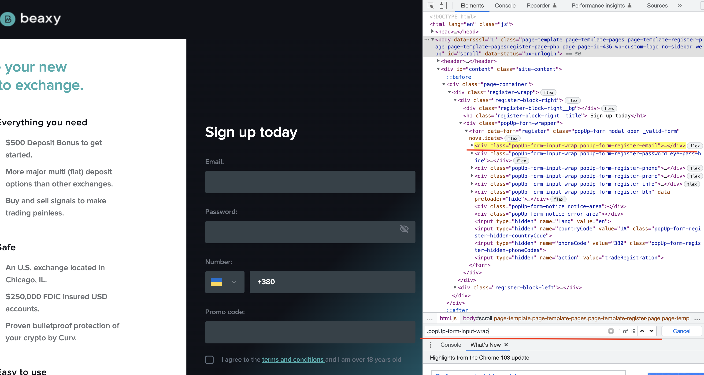

# Selectors

## Navigation in cheetsheet
[Занятие 1 - Переменные и типы данных](#занятие-1---переменные-и-типы-данных)


## Занятие 6 - локаторы

`DOM` – это представление HTML-документа в виде дерева тегов. (добавить картинку)

Локатор (Selector) - это строка, уникально идентифицирующая UI-элемент. 
`XPath` - локаторы - это универсальный механизм для поиска по XML DOM, который так же справляется и с HTML
`CSS` - локаторы были разработаны специально для HTML

Важным различием между `CSS` и `XPath` локаторами является то, что, используя `XPath`, 
мы можем производить перемещение как в глубину `DOM` иерархии, так и возвращаться назад.
Что же касается `CSS`, то тут мы можем двигаться только в глубину.

Пример xpath

```js
//div[@class='g']//a
```
Пример Css

```js
.yuRUbf a
```
Концепция атрибута 
`id` и name - атрибуты, а `article` является их значением.
`input` - элемент

```js
<input id = "article" name = "article" />
```

### Синтаксис XPath

1. `article` - Выбрать все элемент статьи Все дочерние узлы
2. `/article` - Выбрать корневой элемент (на странице корневой элемент обычно HTML-узел)article
3. `//@class` - Выбрать все по имени class Свойства (@ Представляет атрибут класса элемента)
4. `//div` - Выбрать все (в HTML) div дочерний элемент (Неважно, где это появляется в документе)
5. `article//div` - Выбрать все элементы, которые принадлежат элементу article отпрыск элемент div, независимо от того, где он появляется под статьей
6. `article/div` - Выберите все статьи, принадлежащие этой статье Дочерние элементы (должны быть дочерними элементами)Элемент
7. `//a|//img` - Выберите элементы span и ul в документе (| Представляет союз, и)
8 `//*` - Выбрать все Дочерние атрибуты без элемента

```js
1. entry-contents
2. html/head/meta …
3. //div[@class='entry-contents']
4. //div[@class='entry-contents']/div
5. //div[@class='entry-contents']//div
6. //div
7. //a|//img
8. //*[@class="popUp-form-title"]
```

### Поиск элементов через brower devTool

`Browser devTool Console`

```js
 document.getElementById(id) // Находит элемент для построение прямого селектора по id
```

```js
document.querySelectorAll(css-locator)
document.querySelectorAll('.popUp-form-input-wrap'); // Возвращает все элементы внутри elem, удовлетворяющие данному CSS-селектору.
```


```js
document.querySelector(css) 
document.querySelector('.close-eye'); // Возвращает первый элемент, соответствующий данному CSS-селектору.
```

`Browser devTool Elements`
Также можно найти элемент через поиск во вкладке консоли браузера Elements



### Предикаты XPath

1. `//li[@class='page-item']` - Выбрать все принадлежащие Атрибуту class - значения page-item с Элементом li
2. `/article/div[1]` - Выбрать принадлежащий статье Дочерний элемент -  Первый элемент div (Запись: div [1])
3. `/article/div[last()]` - Выбрать принадлежащий статье Дочерний элемент -  Последний элемент div (Запись: div [las())
4. `/article/div[last()-1]` - Выбрать принадлежащий статье Дочерний элемент - Предпоследний элемент div (Запись: div [last () - 1)
 
```js
//li[@class='page-item']
//ul[@class='glossary__list']/li[1]
//ul[@class='glossary__list']/li[last()]
//ul[@class='glossary__list']/li[last()-1] // -2,-3 порядок выбираете сами
```

### XPath - варианты поиска элементов

Пример поиска по дереву элемент за элементом

```js
//div[@class='blog-item']
//div[@class='blog-item']/div
//div[@class='blog-item']/div/div/a
```
Пример выбора элемента из списка

```js
//div[@class='entry-contents']/div[2]
//div[@class='entry-contents']/div[5]
//div[@class='entry-contents']/div[6]
```

Поиск по различным атрибутам

```js
//a[@href='https://www.beaxy.com/blog/introduction-to-crypto-markets-trading/']
//img[@src='/images/pages/pageIntroduction/introduction.jpg']
```
###  Поиск по тексту

Обнаруживает блок в котором находится указанный текст(часть текста)

```js
//h1[text()='Beaxy Blog']
//*[text()='Beaxy Blog']
```

Поиск по содержанию текста

```js
//*[contains(text(),'March')]
//*[contains(text(),'Mar')]
//*[contains(.,'March')]
//p[contains(. ,'March')]
```

Поиск по содержанию текста в начале 

```js
//*[starts-with(text() ,'Market')]
// contains() ищет текст в любом месте, starts-with только в начале строки.
```

### Поиск вверх- вниз

Поиск родитель-родителя вверх по дереву

```js
//a[@href='https://www.beaxy.com/author/james-messi/']/ancestor::article
```

Поиск ребенка у элемента (еще одна вариация)

```js
//div[@class='item-body__info']/child::a
```

Поиск вглубь дерева старший элемент все свои вложенности

```js
//div[@class='entry-contents']/descendant::a
//div[@class='entry-contents']/a - элемент не найден
```
## Занятие 7 - локаторы CSS

### Виды CSS селекторов

Основные виды селекторов

1. `div` – элементы с таким тегом.
2. `#id` – элемент с данным id.
3. `.class` – элементы с таким классом.
4. `[name="value"] `

Селекторы можно комбинировать, записывая последовательно, без пробела:

```js
.c1.c2 – // элементы одновременно с двумя классами c1 и c2
a#id.c1.c2:visited – // элемент a с данным id, классами c1 и c2
```
Вложенности:

```js
div p - // поиск происходит по первому div у кого из потомков есть p
div > p // ищет div у которого прямой родственник p (то есть ребенок)
```

### Псевдоклассы

1. `:first-child` – первый потомок своего родителя.
2. `:last-child` – последний потомок своего родителя.
3. `:only-child` – единственный потомок своего родителя, соседних элементов нет.
4. `:nth-child(a)` – потомок номер a своего родителя, например :nth-child(2) – второй потомок. Нумерация начинается с 1
5. `:nth-child(an+b)` – расширение предыдущего селектора через указание номера потомка формулой, где a,b – константы, а под n подразумевается любое целое число.

```js
1  .exchange-table-body .exchange-table-body_currency:first-child
2  .exchange-table-body .exchange-table-body_currency:last-child
3  .exchange-first-screen-info :only-child 
4. .exchange-table-body .exchange-table-body_currency:nth-child(5)
5. .exchange-table-body .exchange-table-body_currency:nth-child(2n+1)
```

Этот псевдокласс будет фильтровать все элементы, которые попадают под формулу при каком-либо `n`. 
Например: - `:nth-child(2n)` даст элементы номер 2, 4, 6…, то есть четные.

```js
:nth-child(2n+1) - // даст элементы номер 1, 3…, то есть нечётные.
:nth-child(3n+2) - //даст элементы номер 2, 5, 8 и так далее
```

### Аналогичные псевдоклассы

``` js
:first-of-type
:last-of-type
:only-of-type
:nth-of-type
:nth-last-of-type
```
Они имеют в точности тот же смысл, что и обычные `:first-child`, `:last-child` и так далее, 
но во время подсчёта игнорируют элементы с другими тегами, чем тот, к которому применяется фильтр.

```js
1 .entry-content p:first-of-type
2 .entry-content p:last-of-type
3 .entry-content p:only-of-type (если бы “p” был один)
4 .entry-content p:nth-of-type(14)
5 .entry-content p:nth-last-of-type(2n+1)
```

### Селекторы атрибутов CSS

1. `[attribute]` – атрибут установлен,
2. `[attribute="val"]` – атрибут равен val.

На начало атрибута:

3. `[attribute^="val"]` – атрибут начинается с val, например "value".
4. `[attribute|="val"]` – атрибут равен val или начинается с val-, например равен "val-1".

На содержание:

5. `[attribute*="val"]` – атрибут содержит подстроку val, например равен "myvalue".
6. `[attribute~="val"]` – атрибут содержит val как одно из значений через пробел.

Например: `[attr~="delete"]` верно для "edit delete" и неверно для "undelete" или "no-delete".

На конец атрибута:

7. `[attribute$="val"]` – атрибут заканчивается на val, например равен "myval".
